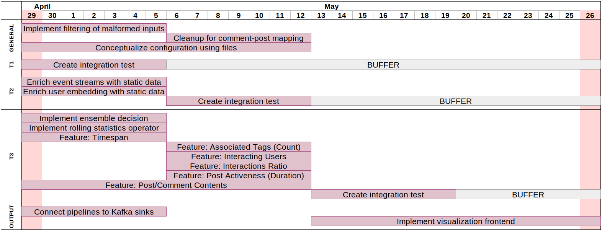

# DSPA 2019 - Midterm Report

Roland Schlaefli, 12-932-398 and Nicolas Kuechler, 14-712-129

## Current Progress

> Your progress so far. Which tasks have you implemented?

TODO: rework TLDR

We are currently focusing on finalizing the recommendations task, building up on the anomaly detection task, as well as general improvements in structure and testability throughout the codebase. We describe our progress in more detail in the following...

### Post Statistics (#1)

The majority of issues for the post statistics task has been completed, including the overall pipeline design, counting of the various types of events, as well as computing the number of unique persons interacting with posts. The most important stateful functionality (i.e., unique person counts) has been tested and the skeleton for a full integration test has been created.

### Friend Recommendations (#2)

Our pipeline for the recommendation of new friends is sketched out in code completely with the functionalities largely implemented. Single key parts are still missing, like the enrichment of activities with static data (e.g., tags of forums and relations between places). The majority of user-defined-functions is tested with specific unit or integration tests. Additionally, a full integration test has been implemented as a skeleton.

### Anomaly Detection (#3)

The pipeline for the anomaly detection task is sketched out completely and first user-defined-functions are already implemented. The skeleton has been created such that the number of features included is easily extendable. A first integration test skeleton is ready for future development.

## Divergences from Planning

> Any divergence from your original plan. Did you change your mind about a tool you wanted to use or an algorithm?

TODO: sketch for kafka postid mapping?
TODO: rework

Contrary to our initially ideated approach of not having intermediate results stored in external systems, our new solution uses a Kafka topic into which postid-comment mappings are produced. The pipelines can then consume this topic to enrich comments with the root postid. This allows for more flexibility regarding the implementation, as we do not need to create a sink that also serves as a source at the same time...

Furthermore, while we were not sure about how to approach testing in general during our initial planning, we ended up using JUnit to test most of our user-defined-functions (map, process, etc.), with the goal of having everything tested. This has greatly helped us in developing these functionalities in isolation and in splitting into separate tasks, allowing for more easy collaboration.

## Challenges & Issues

> Challenges and issues faced so far and how you solved them or planning to solve them.

TODO: extend challenges

The main challenges we faced so far were mostly related to documentation and examples for common patterns. Due to the relatively fast-paced development of Flink, many patterns found in the usual sources are outdated or refer to deprecated methods. It is sometimes hard to find inspiration regarding best practices for non-trivial pipelines. However, the book has been a good support in most of these cases, having more examples on topics like state management.

An additional challenge has been and will be the handling of the input formats and missing values, as we read the input data into Avro objects, which we then produce to Kafka for easy consumption.

## Outstanding Tasks

> Outstanding tasks and a timeline for completion.

TODO: add gantt or burndown style chart?

Up to the current milestone, we have largely developed based on test data derived from the original datasets, allowing us to write reliable integration and unit tests and develop in isolation. An outstanding task will thus be the cleansing of the malformed original input data and making sure that the pipelines work on these much larger datasets.

Furthermore, our general idea is to have one full integration test per task that covers its entire Flink topology. For these tests, we need to derive suitable test data and derive the output as we would expect it from a correctly functioning pipeline.

As we want to produce all of our outputs to Kafka in a final processing step, we will also need to add Kafka sinks to these pipelines and do so in a testable way.

